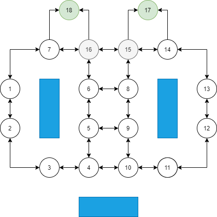
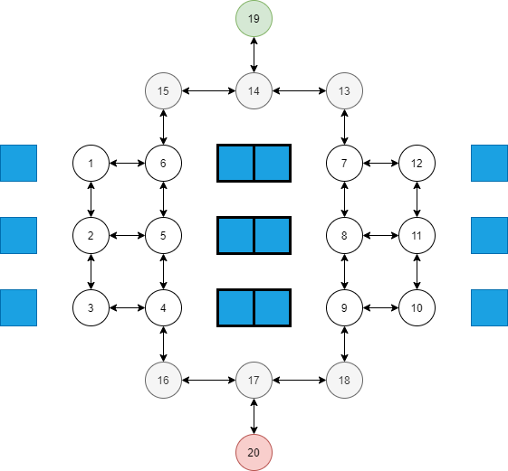

\
Hollman Esteban González Suárez 2172002
\
Jorge Andrés Burgos Fuentes 2172014
\
Jhoann Sebastián Martínez Oviedo 2171995
\

Iniciamos creando el escenario en el que se va a llevar acabo la simulación, en este caso será un supermercado, en el cual las personas tendrán que ir a una o varías estanterías y luego irán a la caja a pagar, el distribución gráfica del supermercado es la siguiente:

<center>

</center>
\
Donde los grafos verdes son las cajas, los grafos blancos son los espacios de una estantería a la que puede ir un cliente, y los grafos grises las rutas donde no hay estantería pero se puede caminar por ahí. Las estanterías son los rectangulos azules.

A continuación creamos los grafos y sus conexiones:

```{r}
graph <- list("1" = c("7", "2"),
              "2" = c("1", "3"),
              "3"= c("2", "4"),
              "4"= c("3", "5", "10"),
              "5"= c("4", "6", "9"),
              "6"= c("5", "16", "8"),
              "7"= c("1", "16", "18"),
              "8"= c("6", "9", "15"),
              "9"= c("5", "10", "8"),
              "10" = c("4", "9", "11"),
              "11" = c("10", "12"),
              "12" = c("11", "13"),
              "13" = c("12", "14"),
              "14" = c("13", "15", "17"),
              "15" = c("8", "14", "16", "17"),
              "16" = c("15", "6", "7", "18"),
              "17" = c("15", "14"),
              "18" = c("7", "16")
              )

weights <- list("1" = c(2, 2),
                "2" = c(2, 2),
                "3" = c(2, 2),
                "4" = c(2, 2, 2),
                "5" = c(2, 2, 2),
                "6" = c(2, 2, 2),
                "7" = c(2, 2, 2),
                "8" = c(2, 2, 2),
                "9" = c(2, 2, 2),
                "10" = c(2, 2, 2),
                "11" = c(2, 2),
                "12" = c(2, 2),
                "13" = c(2, 2),
                "14" = c(2, 2, 2),
                "15" = c(2, 2, 2, 2),
                "16" = c(2, 2, 2, 2),
                "17" = c(2, 2),
                "18" = c(2, 2)
                )
```

Mostramos el grafo:
```{r}
library(igraph)
G <- data.frame(stack(graph), weights = stack(weights)[[1]])
set.seed(500)
el <- as.matrix(stack(graph))
g <- graph_from_edgelist(el)
oldpar <- par(mar = c(1, 1, 1, 1))
plot(g, edge.label = stack(weights)[[1]])
par(oldpar)
```
Función para hallar el largo del camino:
```{r}
path_length <- function(path) {
  if (is.null(path)) return(Inf)
  
  pairs <- cbind(values = path[-length(path)], ind = path[-1])
  sum(merge(pairs, G)[ , "weights"])
}
```

Función para encontrar el camino más corto mediante el algoritmo de Dijkstra:
```{r}
find_shortest_path <- function(graph, start, end, path = c()) {
  if (is.null(graph[[start]])) return(NULL)
  path <- c(path, start)
  
  if (start == end) return(path)
  
  shortest <- NULL

  for (node in graph[[start]]) {

    if (!(node %in% path)) {

      newpath <- find_shortest_path(graph, node, end, path)

      if (path_length(newpath) < path_length(shortest))
        shortest <- newpath
    }
  }
  
  shortest
}
```

Se crea la clase cliente:
```{r}
setClass("Cliente", 
         slots=list(
           mascarilla='numeric', 
           particulas_inhaladas='numeric',
           infectado='numeric',
           ruta = 'character'
           )
         )
```

Función para generar el número de productos que va comprar el cliente, en qué estantería estarán esos productos y la posición en la que va a iniciar el cliente: 
```{r}
lugar = function(){
  n_lugares = sample(2:4,1)
  lugares = sample(1:14,n_lugares)
  return(lugares)
}
```

Función para concatenar los caminos:
```{r}
caminos = function(){
  lugares = lugar()
  camino = c()
  for (i in 2:length(lugares)) {
    primero = toString(lugares[i-1]) 
    ultimo = toString(lugares[i]) 
    ruta = find_shortest_path(graph, primero, ultimo)
    if(i > 2){
      ruta = ruta[-1]
    }
    camino = append(camino, ruta) 
  }
  ult_pos = length(camino)
  ult_graf = camino[ult_pos]
  camino1 = length(find_shortest_path(graph, ult_graf, "17"))
  camino2 = length(find_shortest_path(graph, ult_graf, "18"))
  if(camino1>camino2){
    final_camino = find_shortest_path(graph, ult_graf, "18")
    final_camino = final_camino[-1]
    camino = append(camino, final_camino)
  } else {
    final_camino = find_shortest_path(graph, ult_graf, "17")
    final_camino = final_camino[-1]
    camino = append(camino, final_camino)
  }
  #print(lugares)
  return(camino)
}
```

Función para generar clientes en el supermercado:
```{r}
genera_clientes = function(n_clientes, prob_mascara, prob_infectado){
  clientes = c()
  for (i in 1:n_clientes) {
    tiene_mascara = runif(1)
    esta_infectado = runif(1)
    if(tiene_mascara<prob_mascara && esta_infectado<prob_infectado){
      obj <- new("Cliente",
             mascarilla=1, 
             particulas_inhaladas=0,
             infectado=1,
             ruta = caminos())
      clientes = append(clientes, obj)
    } else if(tiene_mascara>prob_mascara && esta_infectado<prob_infectado) {
      obj <- new("Cliente",
             mascarilla=0, 
             particulas_inhaladas=0,
             infectado=1,
             ruta = caminos())
      clientes = append(clientes, obj)
    } else if(tiene_mascara>prob_mascara && esta_infectado>prob_infectado) {
      obj <- new("Cliente",
             mascarilla=0, 
             particulas_inhaladas=0,
             infectado=0,
             ruta = caminos())
      clientes = append(clientes, obj)
    } else {
      obj <- new("Cliente",
             mascarilla=1, 
             particulas_inhaladas=0,
             infectado=0,
             ruta = caminos())
      clientes = append(clientes, obj)
    }
  }
  return(clientes)
}
clientes = genera_clientes(5, 0.8, 0.1)
```

Función para saber el número de infectados:
```{r}
num_infectados = function(clientes){
  infectados = 0
  for (i in 1:length(clientes)) {
    
    if(clientes[[i]]@infectado == 1){
      infectados = infectados + 1
    }
    
  }
  return(infectados)
}
```

Función para saber el número de mascarillas:
```{r}
num_mascarillas = function(clientes){
  mascarillas = 0
  for (i in 1:length(clientes)) {
    
    if(clientes[[i]]@mascarilla == 1){
      mascarillas = mascarillas + 1
    }
    
  }
  return(mascarillas)
}
```

Main para la simulación del supermercado:
```{r}
main = function(n_clientes, p_mascarilla, p_infectados, ind_limpieza, t_limpieza){
  n = 40
  clientes = genera_clientes(n_clientes, p_mascarilla, p_infectados)
  clientes_ini = num_infectados(clientes)
  estado = matrix(0,16,1)
  for (i in 1:n) {
    if(i%%t_limpieza == 0){
      estado = estado*ind_limpieza
    }
    for (j in 1:n_clientes) {
      if(length(clientes[[j]]@ruta)>i){
        if(clientes[[j]]@infectado==1){
          if(clientes[[j]]@mascarilla==1){
            estado[as.integer(clientes[[j]]@ruta[i])] = estado[as.integer(clientes[[j]]@ruta[i])] + 15*0.2
          } else {
            estado[as.integer(clientes[[j]]@ruta[i])] = estado[as.integer(clientes[[j]]@ruta[i])] + 15
          }
        } else {
          if(clientes[[j]]@mascarilla==1){
            clientes[[j]]@particulas_inhaladas=clientes[[j]]@particulas_inhaladas +
              estado[as.integer(clientes[[j]]@ruta[i])]*0.8
          } else {
            clientes[[j]]@particulas_inhaladas=clientes[[j]]@particulas_inhaladas +
              estado[as.integer(clientes[[j]]@ruta[i])]
          }
        }
        if(clientes[[j]]@particulas_inhaladas>=280){
        clientes[[j]]@infectado=1
        }
      }
    }
  }
  return(list("Clientes"= clientes, "Inicial"=clientes_ini))
}
```


Ahora, para el caso de una clínica: 
<center>

</center>
\
Creamos el grafo para la clínica:
```{r}
graph_c <- list("1" = c("6", "2"),
              "2" = c("1", "3", "5"),
              "3" = c("2", "4"),
              "4" = c("3", "5", "16"),
              "5" = c("4", "6", "2"),
              "6" = c("5", "1", "15"),
              "7" = c("13", "12", "8"),
              "8" = c("7", "9", "11"),
              "9" = c("8", "10", "18"),
              "10" = c("9", "11"),
              "11" = c("8", "10", "12"),
              "12" = c("11", "7"),
              "13" = c("7", "14"),
              "14" = c("13", "15", "19"),
              "15" = c("6", "14"),
              "16" = c("4", "17"),
              "17" = c("16", "18", "20"),
              "18" = c("17", "9"),
              "19" = c("14"),
              "20" = c("17")
              )

weights_c <- list("1" = c(2, 2),
                "2" = c(2, 2, 2),
                "3" = c(2, 2),
                "4" = c(2, 2, 2),
                "5" = c(2, 2, 2),
                "6" = c(2, 2, 2),
                "7" = c(2, 2, 2),
                "8" = c(2, 2, 2),
                "9" = c(2, 2, 2),
                "10" = c(2, 2),
                "11" = c(2, 2, 2),
                "12" = c(2, 2),
                "13" = c(2, 2),
                "14" = c(2, 2, 2),
                "15" = c(2, 2),
                "16" = c(2, 2),
                "17" = c(2, 2, 2),
                "18" = c(2, 2),
                "19" = c(2),
                "20" = c(2)
                )
```

Mostramos el grafo:
```{r}
G1 <- data.frame(stack(graph_c), weights = stack(weights_c)[[1]])
set.seed(500)
el1 <- as.matrix(stack(graph_c))
g1 <- graph_from_edgelist(el1)
oldpar1 <- par(mar = c(1, 1, 1, 1))
plot(g1, edge.label = stack(weights_c)[[1]])
par(oldpar1)
```

Función para generar a la habitación a la que irá el visitante: 
```{r}
habitacion = function(){
  habitacion = sample(1:12,1)
  return(habitacion)
}
```

Función para concatenar los caminos:
```{r}
rutas = function(){
  habitacion = habitacion()
  #print(habitacion)
  camino = c()
  primera_ruta = find_shortest_path(graph_c, "19", toString(habitacion))
  segunda_ruta = find_shortest_path(graph_c, toString(habitacion), "20")
  segunda_ruta = segunda_ruta[-1]
  camino = append(camino, primera_ruta) 
  camino = append(camino, segunda_ruta) 
  return(camino)
}
```

Función para generar los visitantes de la clinica:
```{r}
genera_clientes1 = function(n_clientes, prob_mascara, prob_infectado){
  clientes = c()
  for (i in 1:n_clientes) {
    tiene_mascara = runif(1)
    esta_infectado = runif(1)
    if(tiene_mascara<prob_mascara && esta_infectado<prob_infectado){
      obj <- new("Cliente",
             mascarilla=1, 
             particulas_inhaladas=0,
             infectado=1,
             ruta = rutas())
      clientes = append(clientes, obj)
    } else if(tiene_mascara>prob_mascara && esta_infectado<prob_infectado) {
      obj <- new("Cliente",
             mascarilla=0, 
             particulas_inhaladas=0,
             infectado=1,
             ruta = rutas())
      clientes = append(clientes, obj)
    } else if(tiene_mascara>prob_mascara && esta_infectado>prob_infectado) {
      obj <- new("Cliente",
             mascarilla=0, 
             particulas_inhaladas=0,
             infectado=0,
             ruta = rutas())
      clientes = append(clientes, obj)
    } else {
      obj <- new("Cliente",
             mascarilla=1, 
             particulas_inhaladas=0,
             infectado=0,
             ruta = rutas())
      clientes = append(clientes, obj)
    }
  }
  return(clientes)
}
```

Main de la simulación de la clínica:
```{r}
main2 = function(n_clientes, p_mascarilla, p_infectados, ind_limpieza, t_limpieza){
  n = 40
  clientes = genera_clientes1(n_clientes, p_mascarilla, p_infectados)
  clientes_ini = num_infectados(clientes)
  estado = matrix(0,19,1)
  for (i in 1:n) {
    if(i%%t_limpieza == 0){
      estado = estado*ind_limpieza
    }
    for (j in 1:n_clientes) {
      if(length(clientes[[j]]@ruta)>i){
        if(clientes[[j]]@infectado==1){
          if(clientes[[j]]@mascarilla==1){
            estado[as.integer(clientes[[j]]@ruta[i])] = estado[as.integer(clientes[[j]]@ruta[i])] + 15*0.2
          } else {
            estado[as.integer(clientes[[j]]@ruta[i])] = estado[as.integer(clientes[[j]]@ruta[i])] + 15
          }
        } else {
          if(clientes[[j]]@mascarilla==1){
            clientes[[j]]@particulas_inhaladas=clientes[[j]]@particulas_inhaladas +
              estado[as.integer(clientes[[j]]@ruta[i])]*0.8
          } else {
            clientes[[j]]@particulas_inhaladas=clientes[[j]]@particulas_inhaladas +
              estado[as.integer(clientes[[j]]@ruta[i])]
          }
        }
        if(clientes[[j]]@particulas_inhaladas>=280){
        clientes[[j]]@infectado=1
        }
      }
    }
  }
  return(list("Clientes"= clientes, "Inicial"=clientes_ini))
}
```

Función para simular el supermercado 10 veces:
```{r}
simulacion = function(n_clientes, p_mascarilla, p_infectados){
  contagiados_iniciales = c()
  contagiados_finales = c()
  mascarillas = c()
  for (i in 1:10) {
    clientes = main(n_clientes, p_mascarilla, p_infectados, 0.95, 5)
    contagiados_iniciales = append(contagiados_iniciales, clientes$Inicial)
    mascarillas = append(mascarillas, num_mascarillas(clientes$Clientes)) 
    contagiados_finales = append(contagiados_finales, num_infectados(clientes$Clientes))
  }
  return(list("Contagiados_iniciales" = contagiados_iniciales, "Contagiados_finales" = contagiados_finales, "Mascarillas" = mascarillas))
}
```

Primero, vamos a probar con 10 clientes, una probabilidad de mascarillas de 50% y una probabilidad de que hayan infectados de 20%.
```{r}
simulacion1 = simulacion(10, 0.5, 0.2)
```
Resultados obtenidos:
```{r}
contagiados_iniciales = simulacion1$Contagiados_iniciales
contagiados_finales = simulacion1$Contagiados_finales
mascarillas = simulacion1$Mascarillas
data.frame(contagiados_iniciales, contagiados_finales, mascarillas)
```

```{r}
prom_contagios_iniciales = mean(contagiados_iniciales)
prom_contagios_finales = mean(contagiados_finales)
prom_mascarillas = mean(mascarillas)

cat("Promedio de contagiados iniciales: ", prom_contagios_iniciales, "\n")
cat("Promedio de contagiados finales: ", prom_contagios_finales, "\n")
cat("Promedio de la cantidad de mascarillas: ", prom_mascarillas, "\n")
```

Ahora, vamos a probar con 30 clientes, y las mismas probabilidades de contagio y mascarillas anteriores.
```{r}
simulacion2 = simulacion(30, 0.5, 0.2)
```
Resultados obtenidos:
```{r}
contagiados_iniciales = simulacion2$Contagiados_iniciales
contagiados_finales = simulacion2$Contagiados_finales
mascarillas = simulacion2$Mascarillas
data.frame(contagiados_iniciales, contagiados_finales, mascarillas)
```

```{r}
prom_contagios_iniciales1 = mean(contagiados_iniciales)
prom_contagios_finales1 = mean(contagiados_finales)
prom_mascarillas1 = mean(mascarillas)

cat("Promedio de contagiados iniciales: ", prom_contagios_iniciales1, "\n")
cat("Promedio de contagiados finales: ", prom_contagios_finales1, "\n")
cat("Promedio de la cantidad de mascarillas: ", prom_mascarillas1, "\n")
```

Ahora, vamos a probar con 50 clientes, y las mismas probabilidades de contagio y mascarillas anteriores.
```{r}
simulacion3 = simulacion(50, 0.5, 0.2)
```
Resultados obtenidos:
```{r}
contagiados_iniciales = simulacion3$Contagiados_iniciales
contagiados_finales = simulacion3$Contagiados_finales
mascarillas = simulacion3$Mascarillas
data.frame(contagiados_iniciales, contagiados_finales, mascarillas)
```

```{r}
prom_contagios_iniciales2 = mean(contagiados_iniciales)
prom_contagios_finales2 = mean(contagiados_finales)
prom_mascarillas2 = mean(mascarillas)

cat("Promedio de contagiados iniciales: ", prom_contagios_iniciales2, "\n")
cat("Promedio de contagiados finales: ", prom_contagios_finales2, "\n")
cat("Promedio de la cantidad de mascarillas: ", prom_mascarillas2, "\n")
```
Vemos de manera gráfica el comportamiento de los 3 casos anteriores:
```{r}
x = c(10,30,50)
y = c(prom_contagios_iniciales, prom_contagios_iniciales1, prom_contagios_iniciales2)
y1 = c(prom_contagios_finales, prom_contagios_finales1, prom_contagios_finales2)
y2 = c(prom_mascarillas, prom_mascarillas1, prom_mascarillas2)
plot(x,y,col="red", ylim = c(1,20), type = "l")
lines(x,y1,col="blue")
legend("topleft", legend = c("Contagios iniciales", "Contagios finales"), lwd = 3, col = c("red", "blue"))
```

Ahora, vamos a probar con 30 clientes, una probabilidad de mascarillas de 30% y una probabilidad de que hayan infectados de 20%.
```{r}
simulacion4 = simulacion(30, 0.3, 0.2)
```
Resultados obtenidos:
```{r}
contagiados_iniciales = simulacion4$Contagiados_iniciales
contagiados_finales = simulacion4$Contagiados_finales
mascarillas = simulacion4$Mascarillas
data.frame(contagiados_iniciales, contagiados_finales, mascarillas)
```

```{r}
prom_contagios_iniciales3 = mean(contagiados_iniciales)
prom_contagios_finales3 = mean(contagiados_finales)
prom_mascarillas3 = mean(mascarillas)

cat("Promedio de contagiados iniciales: ", prom_contagios_iniciales3, "\n")
cat("Promedio de contagiados finales: ", prom_contagios_finales3, "\n")
cat("Promedio de la cantidad de mascarillas: ", prom_mascarillas3, "\n")
```

Ahora, vamos a probar con 30 clientes, una probabilidad de mascarillas de 70% y una probabilidad de que hayan infectados de 20%.
```{r}
simulacion5 = simulacion(30, 0.7, 0.2)
```

```{r}
contagiados_iniciales = simulacion5$Contagiados_iniciales
contagiados_finales = simulacion5$Contagiados_finales
mascarillas = simulacion5$Mascarillas
data.frame(contagiados_iniciales, contagiados_finales, mascarillas)
```

```{r}
prom_contagios_iniciales4 = mean(contagiados_iniciales)
prom_contagios_finales4 = mean(contagiados_finales)
prom_mascarillas4 = mean(mascarillas)

cat("Promedio de contagiados iniciales: ", prom_contagios_iniciales4, "\n")
cat("Promedio de contagiados finales: ", prom_contagios_finales4, "\n")
cat("Promedio de la cantidad de mascarillas: ", prom_mascarillas4, "\n")
```
Vemos de manera gráfica los resultados obtenidos variando los porcentajes de mascarilla entre 30%, 50% y 70%.
```{r}
x = c(0.3,0.5,0.7)
y = c(prom_contagios_iniciales3, prom_contagios_iniciales1, prom_contagios_iniciales4)
y1 = c(prom_contagios_finales3, prom_contagios_finales1, prom_contagios_finales4)
y2 = c(prom_mascarillas3, prom_mascarillas1, prom_mascarillas4)
plot(x,y,col="red", ylim = c(1,20), type = "l")
lines(x,y1,col="blue")
legend("topleft", legend = c("Contagios iniciales", "Contagios finales"), lwd = 3, col = c("red", "blue"))
```

Ahora, vamos a probar con 30 clientes, una probabilidad de mascarillas de 50% y una probabilidad de que hayan infectados de 40%.
```{r}
simulacion6 = simulacion(30, 0.5, 0.4)
```
Resultados obtenidos:
```{r}
contagiados_iniciales = simulacion6$Contagiados_iniciales
contagiados_finales = simulacion6$Contagiados_finales
mascarillas = simulacion6$Mascarillas
data.frame(contagiados_iniciales, contagiados_finales, mascarillas)
```

```{r}
prom_contagios_iniciales5 = mean(contagiados_iniciales)
prom_contagios_finales5 = mean(contagiados_finales)
prom_mascarillas5 = mean(mascarillas)

cat("Promedio de contagiados iniciales: ", prom_contagios_iniciales5, "\n")
cat("Promedio de contagiados finales: ", prom_contagios_finales5, "\n")
cat("Promedio de la cantidad de mascarillas: ", prom_mascarillas5, "\n")
```

Ahora, vamos a probar con 30 clientes, una probabilidad de mascarillas de 50% y una probabilidad de que hayan infectados de 60%.
```{r}
simulacion7 = simulacion(30, 0.5, 0.6)
```
Resultados obtenidos:
```{r}
contagiados_iniciales = simulacion7$Contagiados_iniciales
contagiados_finales = simulacion7$Contagiados_finales
mascarillas = simulacion7$Mascarillas
data.frame(contagiados_iniciales, contagiados_finales, mascarillas)
```

```{r}
prom_contagios_iniciales6 = mean(contagiados_iniciales)
prom_contagios_finales6 = mean(contagiados_finales)
prom_mascarillas6 = mean(mascarillas)

cat("Promedio de contagiados iniciales: ", prom_contagios_iniciales6, "\n")
cat("Promedio de contagiados finales: ", prom_contagios_finales6, "\n")
cat("Promedio de la cantidad de mascarillas: ", prom_mascarillas6, "\n")
```
Vemos de manera gráfica como se comporta la cantidad de contagiados al variar el porcentaje de contagiados inicales entre 20%, 40% y 60%.
```{r}
x = c(0.2,0.4,0.6)
y = c(prom_contagios_iniciales1, prom_contagios_iniciales5, prom_contagios_iniciales6)
y1 = c(prom_contagios_finales1, prom_contagios_finales5, prom_contagios_finales6)
plot(x,y,col="red", ylim = c(1,25), type = "l")
lines(x,y1,col="blue")
legend("topleft", legend = c("Contagios iniciales", "Contagios finales"), lwd = 3, col = c("red", "blue"))
```

Función para simular la clínica 10 veces:
```{r}
simulacion1 = function(n_clientes, p_mascarilla, p_infectados){
  contagiados_iniciales = c()
  contagiados_finales = c()
  mascarillas = c()
  for (i in 1:10) {
    clientes = main2(n_clientes, p_mascarilla, p_infectados, 0.2, 4)
    contagiados_iniciales = append(contagiados_iniciales, clientes$Inicial)
    mascarillas = append(mascarillas, num_mascarillas(clientes$Clientes)) 
    contagiados_finales = append(contagiados_finales, num_infectados(clientes$Clientes))
  }
  return(list("Contagiados_iniciales" = contagiados_iniciales, "Contagiados_finales" = contagiados_finales, "Mascarillas" = mascarillas))
}
```

Primero simulamos el caso de tener 10 personas en el establecimiento, con 50% de probabilidad de mascarilla y 20% de probabilidad de contagiados iniciales.
```{r}
simulacion8 = simulacion1(10, 0.5, 0.2)
```
Resultados:
```{r}
contagiados_iniciales = simulacion8$Contagiados_iniciales
contagiados_finales = simulacion8$Contagiados_finales
mascarillas = simulacion8$Mascarillas
data.frame(contagiados_iniciales, contagiados_finales, mascarillas)
```

```{r}
prom_contagios_iniciales7 = mean(contagiados_iniciales)
prom_contagios_finales7 = mean(contagiados_finales)
prom_mascarillas7 = mean(mascarillas)

cat("Promedio de contagiados iniciales: ", prom_contagios_iniciales7, "\n")
cat("Promedio de contagiados finales: ", prom_contagios_finales7, "\n")
cat("Promedio de la cantidad de mascarillas: ", prom_mascarillas7, "\n")
```
Ahora simulamos el mismo caso anterior pero con 30 personas.
```{r}
simulacion9 = simulacion1(30, 0.5, 0.2)
```
Resultados obtenidos:
```{r}
contagiados_iniciales = simulacion9$Contagiados_iniciales
contagiados_finales = simulacion9$Contagiados_finales
mascarillas = simulacion9$Mascarillas
data.frame(contagiados_iniciales, contagiados_finales, mascarillas)
```

```{r}
prom_contagios_iniciales8 = mean(contagiados_iniciales)
prom_contagios_finales8 = mean(contagiados_finales)
prom_mascarillas8 = mean(mascarillas)

cat("Promedio de contagiados iniciales: ", prom_contagios_iniciales8, "\n")
cat("Promedio de contagiados finales: ", prom_contagios_finales8, "\n")
cat("Promedio de la cantidad de mascarillas: ", prom_mascarillas8, "\n")
```
A continuación simulamos el mismo caso anterior pero con 50 personas.
```{r}
simulacion10 = simulacion1(50, 0.5, 0.2)
```
Resultados:
```{r}
contagiados_iniciales = simulacion10$Contagiados_iniciales
contagiados_finales = simulacion10$Contagiados_finales
mascarillas = simulacion10$Mascarillas
data.frame(contagiados_iniciales, contagiados_finales, mascarillas)
```

```{r}
prom_contagios_iniciales9 = mean(contagiados_iniciales)
prom_contagios_finales9 = mean(contagiados_finales)
prom_mascarillas9 = mean(mascarillas)

cat("Promedio de contagiados iniciales: ", prom_contagios_iniciales9, "\n")
cat("Promedio de contagiados finales: ", prom_contagios_finales9, "\n")
cat("Promedio de la cantidad de mascarillas: ", prom_mascarillas9, "\n")
```
Vemos de manera gráfica como se comporta la cantidad de contagios al variar la cantidad de personas:
```{r}
x = c(10,30,50)
y = c(prom_contagios_iniciales7, prom_contagios_iniciales8, prom_contagios_iniciales9)
y1 = c(prom_contagios_finales7, prom_contagios_finales8, prom_contagios_finales9)
plot(x,y,col="red", ylim = c(1,40), type = "l")
lines(x,y1,col="blue")
legend("topleft", legend = c("Contagios iniciales", "Contagios finales"), lwd = 3, col = c("red", "blue"))
```
Ahora simulamos el caso de tener 30 personas, con 30% de probabilidad de mascarilla y 20% de probabilidad de contagiados iniciales.
```{r}
simulacion11 = simulacion1(30, 0.3, 0.2)
```
Resultados:
```{r}
contagiados_iniciales = simulacion11$Contagiados_iniciales
contagiados_finales = simulacion11$Contagiados_finales
mascarillas = simulacion11$Mascarillas
data.frame(contagiados_iniciales, contagiados_finales, mascarillas)
```

```{r}
prom_contagios_iniciales10 = mean(contagiados_iniciales)
prom_contagios_finales10 = mean(contagiados_finales)
prom_mascarillas10 = mean(mascarillas)

cat("Promedio de contagiados iniciales: ", prom_contagios_iniciales10, "\n")
cat("Promedio de contagiados finales: ", prom_contagios_finales10, "\n")
cat("Promedio de la cantidad de mascarillas: ", prom_mascarillas10, "\n")
```
A continuación simulamos el mismo caso anterior pero con 70% de probabilidad de mascarillas.
```{r}
simulacion12 = simulacion1(30, 0.7, 0.2)
```
Resultados obtenidos:
```{r}
contagiados_iniciales = simulacion12$Contagiados_iniciales
contagiados_finales = simulacion12$Contagiados_finales
mascarillas = simulacion12$Mascarillas
data.frame(contagiados_iniciales, contagiados_finales, mascarillas)
```

```{r}
prom_contagios_iniciales11 = mean(contagiados_iniciales)
prom_contagios_finales11 = mean(contagiados_finales)
prom_mascarillas11 = mean(mascarillas)

cat("Promedio de contagiados iniciales: ", prom_contagios_iniciales11, "\n")
cat("Promedio de contagiados finales: ", prom_contagios_finales11, "\n")
cat("Promedio de la cantidad de mascarillas: ", prom_mascarillas11, "\n")
```
Vemos de manera gráfica como se comporta la cantidad de contagiados al variar la probabilidad de mascarillas:
```{r}
x = c(0.3,0.5,0.7)
y = c(prom_contagios_iniciales10, prom_contagios_iniciales8, prom_contagios_iniciales11)
y1 = c(prom_contagios_finales10, prom_contagios_finales8, prom_contagios_finales11)
plot(x,y,col="red", ylim = c(1,25), type = "l")
lines(x,y1,col="blue")
legend("topleft", legend = c("Contagios iniciales", "Contagios finales"), lwd = 3, col = c("red", "blue"))
```
Ahora simulamos el caso de tener 30 personas, 50% de probabilidad de mascarillas y 40% de probabilidad de contagios.
```{r}
simulacion13 = simulacion1(30, 0.5, 0.4)
```
Resultados obtenidos:
```{r}
contagiados_iniciales = simulacion13$Contagiados_iniciales
contagiados_finales = simulacion13$Contagiados_finales
mascarillas = simulacion13$Mascarillas
data.frame(contagiados_iniciales, contagiados_finales, mascarillas)
```

```{r}
prom_contagios_iniciales12 = mean(contagiados_iniciales)
prom_contagios_finales12 = mean(contagiados_finales)
prom_mascarillas12 = mean(mascarillas)

cat("Promedio de contagiados iniciales: ", prom_contagios_iniciales12, "\n")
cat("Promedio de contagiados finales: ", prom_contagios_finales12, "\n")
cat("Promedio de la cantidad de mascarillas: ", prom_mascarillas12, "\n")
```
Por último, repetimos la simulación anterior pero variando la probabilidad de contagiados inciales al 60%
```{r}
simulacion14 = simulacion1(30, 0.5, 0.6)
```

```{r}
contagiados_iniciales = simulacion14$Contagiados_iniciales
contagiados_finales = simulacion14$Contagiados_finales
mascarillas = simulacion14$Mascarillas
data.frame(contagiados_iniciales, contagiados_finales, mascarillas)
```

```{r}
prom_contagios_iniciales13 = mean(contagiados_iniciales)
prom_contagios_finales13 = mean(contagiados_finales)
prom_mascarillas13 = mean(mascarillas)

cat("Promedio de contagiados iniciales: ", prom_contagios_iniciales13, "\n")
cat("Promedio de contagiados finales: ", prom_contagios_finales13, "\n")
cat("Promedio de la cantidad de mascarillas: ", prom_mascarillas13, "\n")
```
Observamos de manera gráfica como se comporta la cantidad de contagiados al variar el porcentaje de contagiados iniciales.
```{r}
x = c(0.2,0.4,0.6)
y = c(prom_contagios_iniciales8, prom_contagios_iniciales12, prom_contagios_iniciales13)
y1 = c(prom_contagios_finales8, prom_contagios_finales12, prom_contagios_finales13)
plot(x,y,col="red", ylim = c(1,27), type = "l")
lines(x,y1,col="blue")
legend("topleft", legend = c("Contagios iniciales", "Contagios finales"), lwd = 3, col = c("red", "blue"))
```


